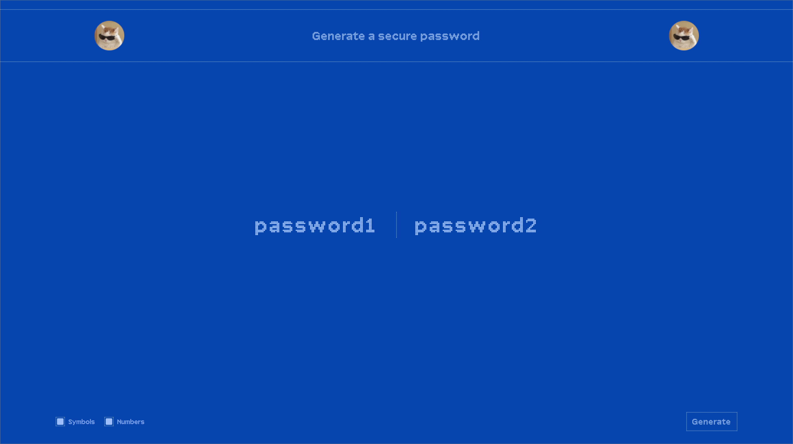

# Password Generator

A simple web application that generates two random secure passwords. Built with HTML, CSS and vanilla JavaScript.

## Features
- Generates two 15-character passwords simultaneously
- Toggle options for including numbers and symbols
- Clean, minimalist interface with dotted borders and custom font
- Responsive design that works on different screen sizes

## Implementation
- Pure JavaScript for password generation logic
- Custom checkbox styling with CSS
- Flexbox layout system
- Custom Array font family
- Color scheme using shades of blue (#0645AD, #9CC0FC)

## Usage
Click the "Generate" button to create new passwords. Use the checkboxes to:
- Include/exclude symbols (~,!,@,#, etc.)
- Include/exclude numbers (0-9)

The passwords will always include both uppercase and lowercase letters.

## Screenshot
